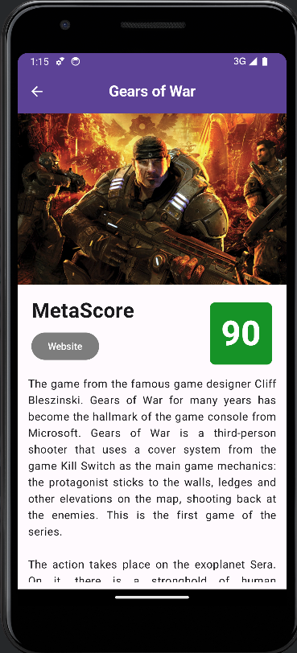

  

<h3 align="center">Game Catalogue</h3>

## 📝 Table of Contents

- [About](#about)
- [Getting Started](#getting_started)
- [Usage](#usage)
- [Built Using](#built_using)
- [Authors](#authors)

## 🧐 About 

Game catalogue is an Android app, which allows you to search information about your favourite videogames. The information about the videogames is retrieved from [RAWG API](https://rawg.io/apidocs) and displayed in the app.

## 🏁 Getting Started 

* Install Android Studio, which will help you to setup the environment to run the application.
* Clone this repository to you computer.
* Open the project in Android Studio.
* Run the app

### Prerequisites

- Gradle
- Android Studio
- Kotlin SDK

## 🎈 Usage 

### Home screen

In the home screen you will find a list of the videgames that are available in the catalogue. Each videogame is displayed in its own card, which contains an image and the name of the videogame.

If you select the card, you will navigate to the detail screen, which will show you the information about the videogame you selected.

The home screen contains a search bar to find an specific videogame and videogames with similar names.

The game catalog must have internet connection to retrieve the videogames and their information, that's why if there is no internet connection, you won't be able to use the app.

### Detail screen

In the detail screen you will find information (name, image, metacritics score, description, website) about an specific videogame.

## ⛏️ Built Using 

- [Jetpack Compose](https://developer.android.com/jetpack/compose) - UI
- [Kotlin](https://kotlinlang.org/) - Server Environment
- [Dagger Hilt](https://dagger.dev/hilt/) - Dependency Injection
- [Retrofit](https://github.com/square/retrofit) - HTTP Client

## ✍️ Authors 

- [@EdgarRamirezFuentes](https://github.com/EdgarRamirezFuentes)